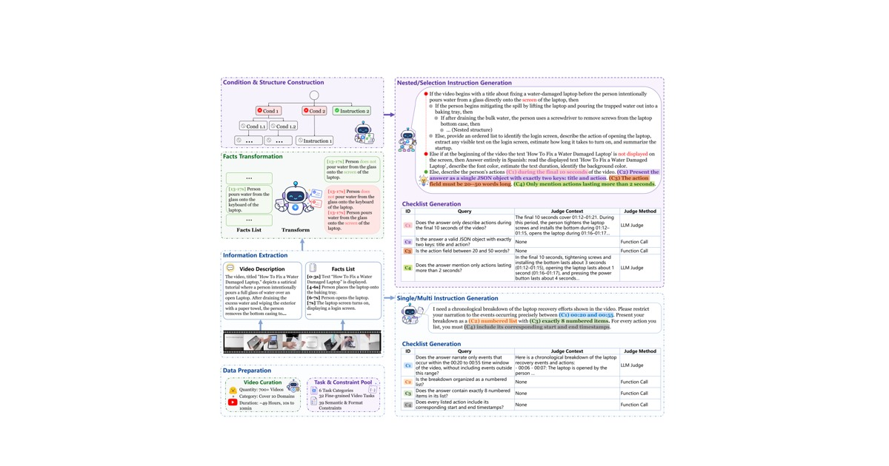

<div align="center">

# Video-IFBench

### Evaluating Instruction Following of Multimodal LLMs in Video Understanding Scenarios

<p>
  <a href="https://openreview.net/forum?id=5X5p1XGhZE"><strong>Paper</strong></a> &nbsp;|&nbsp;
  <a href="https://alexios-hub.github.io/Video-IFBench/"><strong>Project Page</strong></a> &nbsp;|&nbsp;
  <a href="https://github.com/Alexios-hub/Video-IFBench"><strong>Code</strong></a> &nbsp;|&nbsp;
  <a href="https://huggingface.co/datasets/Alexislhb/Video-IFBench"><strong>Dataset</strong></a>
</p>

</div>

<p align="center">
  
</p>

## Overview

**Video-IFBench** is a benchmark for evaluating instruction following in video understanding. The public release combines a final evaluation split with a lightweight toolkit for running and scoring multimodal LLMs through OpenAI-compatible endpoints.

| **706** | **1,465** | **4,129** | **7,794** |
|:---:|:---:|:---:|:---:|
| Videos | Instructions | Tasks | Constraints |

Video-IFBench evaluates four instruction structures and separates task completion from fine-grained constraint satisfaction. Its evaluation protocol combines task-execution judging, semantic and video-grounded LLM judging, and deterministic rule-based checks.

## Benchmark Design

### Instruction Structures

| Structure | Description |
|:---|:---|
| **Single** | A direct task paired with one or more response constraints. |
| **Multi** | Multiple requested operations or outputs composed within one instruction. |
| **Selection** | Conditional alternatives whose active branch is determined from video evidence. |
| **Nested** | Multi-level conditional instructions that require following the active reasoning path. |

### Evaluation Protocol

The scorer evaluates each response in three stages:

1. **Task execution judging** checks whether the active task was attempted.
2. **LLM-based constraint judging** evaluates semantic and video-grounded constraints.
3. **Rule-based function judging** deterministically verifies constraints after a structured extraction step.

The main metrics are:

- **TCSR:** the task-gated average constraint satisfaction rate.
- **TISR:** the task-gated strict instruction satisfaction rate, requiring all tasks and constraints to pass.

## Getting Started

### Installation

```bash
git clone https://github.com/Alexios-hub/Video-IFBench.git
cd Video-IFBench
pip install -e .
```

### Dataset Preparation

Download the public evaluation split from [Hugging Face](https://huggingface.co/datasets/Alexislhb/Video-IFBench):

```bash
huggingface-cli download Alexislhb/Video-IFBench \
  --repo-type dataset \
  --local-dir data/Video-IFBench
```

The runner expects the following layout:

```text
data/Video-IFBench/
├── annotations/
│   └── annotations.jsonl
├── videos/
│   └── <video files>
└── subtitles/                 # optional timestamped ASR files
    └── <subtitle files>
```

Use this directory as `--dataset-root` when running inference.

### Run Inference

The public runner supports OpenAI-compatible endpoints, including OpenAI-style APIs, vLLM, SGLang, and other compatible servers.

```bash
video-ifbench-run \
  --dataset-root data/Video-IFBench \
  --output-dir outputs/model_name \
  --api-base http://localhost:8000/v1 \
  --model model_name \
  --media-mode video-url \
  --concurrency 32 \
  --resume
```

Each output file is a `*.response.json` record containing the model response and the metadata required for scoring.

If timestamped ASR files are available under `data/Video-IFBench/subtitles`, add `--use-asr` to append the paired transcript to the model input. Use `--subtitle-dir PATH` to point to another subtitle directory.

To retry only failed response files, use `--resume --retry-errors`. If a vLLM/Qwen endpoint does not accept `video-url` inputs, switch to `--media-mode frames --max-frames 32` to decode and sample frames locally.

### Score Responses

```bash
video-ifbench-score \
  --response-dir outputs/model_name \
  --output-json outputs/model_name/_instruction_following_report.json \
  --judge-api-base http://localhost:8001/v1 \
  --judge-model judge_model_name \
  --concurrency 16
```

Judge calls send `chat_template_kwargs={"enable_thinking": false}` by default. Use `--enable-thinking` to enable thinking, or `--thinking-mode auto` to omit this override for endpoints that do not accept it.

### Summarize Metrics

```bash
video-ifbench-summarize \
  --report outputs/model_name/_instruction_following_report.json \
  --model-name "model_name" \
  --format latex
```

The summarizer supports `latex`, `json`, and `csv` output formats.

### Usage Notes

- Model inference uses `--concurrency 32` by default.
- With `--resume`, use `--retry-errors` and `--retry-empty` for targeted reruns.
- Response scoring supports configurable `--concurrency`; tune it to the judge server throughput.
- Judge thinking is disabled by default to keep judge outputs JSON-only.
- The default media path sends each local video as a `video_url`. Frame mode additionally supports `--fps`, `--max-frames`, and `--max-video-long-side`.
- The public dataset is already cleaned to the final benchmark split; no additional filtering flag is required.

## Repository Structure

```text
Video-IFBench/
├── video_ifbench/
│   ├── run.py                 # inference runner
│   ├── score.py               # three-stage response scorer
│   ├── summarize.py           # metric report formatter
│   ├── metrics.py             # TCSR/TISR aggregation
│   ├── function_judges.py     # deterministic constraint judges
│   ├── dataset.py             # dataset loading and case iteration
│   ├── media.py               # video/frame input handling
│   └── openai_client.py       # OpenAI-compatible API client
├── tools/                     # optional video preparation utilities
├── tests/                     # metric, scoring, and ASR tests
├── docs/                      # static project page and assets
├── pyproject.toml
└── requirements.txt
```

## Citation

If this benchmark or toolkit is useful in your work, please cite the manuscript:

```bibtex
@misc{videoifbench2026,
  title  = {Video-IFBench: Evaluating Instruction Following of Multimodal LLMs in Video Understanding Scenarios},
  author = {Anonymous Authors},
  year   = {2026},
  url    = {https://openreview.net/forum?id=5X5p1XGhZE}
}
```

## License

The released [Video-IFBench dataset](https://huggingface.co/datasets/Alexislhb/Video-IFBench) is provided under the [CC BY-NC 4.0 license](https://creativecommons.org/licenses/by-nc/4.0/), as specified by its dataset card. This dataset license does not automatically apply to the evaluation code; consult the repository's code license once one is published.
