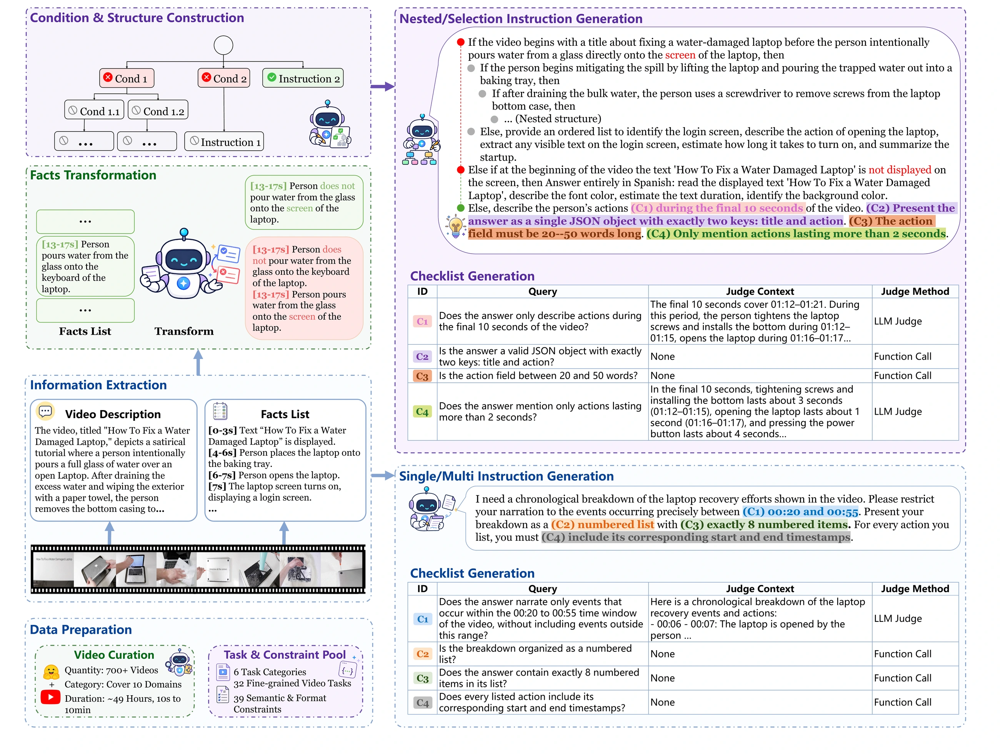

# Video-IFBench: Evaluating Instruction Following of Multimodal LLMs in Video Understanding Scenarios

<p align="center">
  <a href="https://scholar.google.com/citations?user=GcgqbCUAAAAJ&hl=zh-CN"><strong>Hongbo Liu</strong></a><sup>1,*</sup>,
  &emsp;
  <a href="https://scholar.google.com/citations?user=WRGF9B8AAAAJ"><strong>Peixian Chen</strong></a><sup>2,*</sup>,
  &emsp;
  <a href="https://scholar.google.com/citations?user=N_0VdSwAAAAJ"><strong>Sihan Liu</strong></a><sup>2</sup>,
  &emsp;
  <a href="https://scholar.google.com/citations?user=rQbW67AAAAAJ"><strong>Peiyuan Zhang</strong></a><sup>3</sup>,
  &emsp;
  <a href="https://scholar.google.com/citations?user=Bd6y_UsAAAAJ"><strong>Kai Zou</strong></a><sup>4</sup>,
  &emsp;
  <a href="https://scholar.google.com/citations?user=0dkD_dcAAAAJ"><strong>Dian Zheng</strong></a><sup>5</sup>,
  &emsp;
  <a href="https://scholar.google.com/citations?user=zBM8_XkAAAAJ"><strong>Xiaoxing Hu</strong></a><sup>3</sup>,
  &emsp;
  <a href="https://scholar.google.com/citations?user=kMui170AAAAJ"><strong>Yuhao Dong</strong></a><sup>6</sup>,
  &emsp;
  <a href="https://scholar.google.com/citations?user=C941xtsAAAAJ"><strong>Mengdan Zhang</strong></a><sup>2</sup>,
  &emsp;
  <a href="https://scholar.google.com/citations?user=29teR74AAAAJ"><strong>Yunhang Shen</strong></a><sup>2</sup>,
  &emsp;
  <a href="https://scholar.google.com/citations?user=LV8ejn8AAAAJ"><strong>Haoyu Cao</strong></a><sup>2</sup>,
  &emsp;
  <a href="https://scholar.google.com/citations?user=AjxoEpIAAAAJ"><strong>Wei Liu</strong></a><sup>2</sup>,
  &emsp;
  <a href="https://github.com/Alexios-hub/Video-IFBench#no-profile" aria-disabled="true"><strong>Weibo Gu</strong></a><sup>2</sup>,
  &emsp;
  <a href="https://scholar.google.com/citations?user=IUtix9IAAAAJ"><strong>Xing Sun</strong></a><sup>2</sup>,
  &emsp;
  <a href="https://github.com/Alexios-hub/Video-IFBench#no-profile" aria-disabled="true"><strong>Shengjie Zhao</strong></a><sup>1,&dagger;</sup>
</p>

<p align="center">
  <sup>1</sup>TJU &emsp;
  <sup>2</sup>Tencent Youtu Lab &emsp;
  <sup>3</sup>SJTU &emsp;
  <sup>4</sup>Tencent Hunyuan &emsp;
  <sup>5</sup>CUHK &emsp;
  <sup>6</sup>NTU
</p>

<p align="center">
  <sup>*</sup> Equal contribution &emsp;
  <sup>&dagger;</sup> Corresponding author
</p>

<p align="center">
  
  <a href="https://alexios-hub.github.io/Video-IFBench/">
    
  </a>
  <a href="https://huggingface.co/datasets/Alexislhb/Video-IFBench">
    
  </a>
</p>

<p align="center">
  
</p>

## 🎬 Overview

**Video-IFBench** is a benchmark for evaluating instruction following in video understanding. The public release combines a final evaluation split with a lightweight toolkit for running and scoring multimodal LLMs through OpenAI-compatible endpoints.

Video-IFBench evaluates four instruction structures and separates task completion from fine-grained constraint satisfaction. Its evaluation protocol combines task-execution judging, semantic and video-grounded LLM judging, and deterministic rule-based checks.

## 🧩 Benchmark Design

### Instruction Structures

| Structure | Description |
|:---|:---|
| **Single** | A direct task paired with one or more response constraints. |
| **Multi** | Multiple requested operations or outputs composed within one instruction. |
| **Selection** | Conditional alternatives whose active branch is determined from video evidence. |
| **Nested** | Multi-level conditional instructions that require following the active reasoning path. |

### Evaluation Protocol

The scorer evaluates each response in three stages:

1. **Task execution judging** checks whether the active task was attempted.
2. **LLM-based constraint judging** evaluates semantic and video-grounded constraints.
3. **Rule-based function judging** deterministically verifies constraints after a structured extraction step.

The main metrics are:

- **TCSR:** the task-gated average constraint satisfaction rate.
- **TISR:** the task-gated strict instruction satisfaction rate, requiring all tasks and constraints to pass.

## 📊 Main Results

<div align="center">
<table width="100%">
  <caption>
    <small>
      TCSR and TISR are reported in percent to three significant figures. Best results within each model group are in bold.
    </small>
  </caption>
  <thead>
    <tr>
      <th scope="col" rowspan="2" align="left" width="25%">Model</th>
      <th scope="colgroup" colspan="2" align="center" width="15%">Single</th>
      <th scope="colgroup" colspan="2" align="center" width="15%">Multi</th>
      <th scope="colgroup" colspan="2" align="center" width="15%">Selection</th>
      <th scope="colgroup" colspan="2" align="center" width="15%">Nested</th>
      <th scope="colgroup" colspan="2" align="center" width="15%">Overall</th>
    </tr>
    <tr>
      <th scope="col" align="center" width="7.5%"><small>TCSR</small></th>
      <th scope="col" align="center" width="7.5%"><small>TISR</small></th>
      <th scope="col" align="center" width="7.5%"><small>TCSR</small></th>
      <th scope="col" align="center" width="7.5%"><small>TISR</small></th>
      <th scope="col" align="center" width="7.5%"><small>TCSR</small></th>
      <th scope="col" align="center" width="7.5%"><small>TISR</small></th>
      <th scope="col" align="center" width="7.5%"><small>TCSR</small></th>
      <th scope="col" align="center" width="7.5%"><small>TISR</small></th>
      <th scope="col" align="center" width="7.5%"><small>TCSR</small></th>
      <th scope="col" align="center" width="7.5%"><small>TISR</small></th>
    </tr>
  </thead>
  <tbody>
    <tr><th scope="rowgroup" colspan="11" align="center"><em>Proprietary Models</em></th></tr>
    <tr>
      <th scope="row" align="left"><small>Gemini-3-Pro</small></th>
      <td align="center"><small><strong>79.6</strong></small></td>
      <td align="center"><small><strong>52.3</strong></small></td>
      <td align="center"><small><strong>88.6</strong></small></td>
      <td align="center"><small><strong>58.8</strong></small></td>
      <td align="center"><small><strong>68.5</strong></small></td>
      <td align="center"><small><strong>59.2</strong></small></td>
      <td align="center"><small><strong>53.7</strong></small></td>
      <td align="center"><small><strong>46.0</strong></small></td>
      <td align="center"><small><strong>76.5</strong></small></td>
      <td align="center"><small><strong>54.5</strong></small></td>
    </tr>
    <tr>
      <th scope="row" align="left"><small>Gemini-3-Flash</small></th>
      <td align="center"><small>76.7</small></td>
      <td align="center"><small>49.2</small></td>
      <td align="center"><small>87.6</small></td>
      <td align="center"><small>56.4</small></td>
      <td align="center"><small>63.9</small></td>
      <td align="center"><small>54.8</small></td>
      <td align="center"><small>39.9</small></td>
      <td align="center"><small>30.7</small></td>
      <td align="center"><small>72.2</small></td>
      <td align="center"><small>49.5</small></td>
    </tr>
    <tr>
      <th scope="row" align="left"><small>Doubao-Seed-2.0-Pro-260215</small></th>
      <td align="center"><small>76.7</small></td>
      <td align="center"><small>44.6</small></td>
      <td align="center"><small>87.1</small></td>
      <td align="center"><small>51.1</small></td>
      <td align="center"><small>46.5</small></td>
      <td align="center"><small>38.2</small></td>
      <td align="center"><small>17.8</small></td>
      <td align="center"><small>14.4</small></td>
      <td align="center"><small>65.7</small></td>
      <td align="center"><small>40.8</small></td>
    </tr>
    <tr>
      <th scope="row" align="left"><small>GPT-5.4</small></th>
      <td align="center"><small>72.8</small></td>
      <td align="center"><small>34.7</small></td>
      <td align="center"><small>82.4</small></td>
      <td align="center"><small>43.2</small></td>
      <td align="center"><small>21.1</small></td>
      <td align="center"><small>16.9</small></td>
      <td align="center"><small>12.1</small></td>
      <td align="center"><small>7.60</small></td>
      <td align="center"><small>57.4</small></td>
      <td align="center"><small>30.0</small></td>
    </tr>
    <tr><th scope="rowgroup" colspan="11" align="center"><em>Open-source Models (Instruct)</em></th></tr>
    <tr>
      <th scope="row" align="left"><small>Qwen2.5-Omni-3B</small></th>
      <td align="center"><small>35.2</small></td>
      <td align="center"><small>11.6</small></td>
      <td align="center"><small>34.0</small></td>
      <td align="center"><small>8.60</small></td>
      <td align="center"><small>7.70</small></td>
      <td align="center"><small>5.40</small></td>
      <td align="center"><small>6.50</small></td>
      <td align="center"><small>4.50</small></td>
      <td align="center"><small>25.8</small></td>
      <td align="center"><small>8.60</small></td>
    </tr>
    <tr>
      <th scope="row" align="left"><small>Qwen2.5-Omni-7B</small></th>
      <td align="center"><small>46.3</small></td>
      <td align="center"><small>16.6</small></td>
      <td align="center"><small>48.6</small></td>
      <td align="center"><small>14.9</small></td>
      <td align="center"><small>15.6</small></td>
      <td align="center"><small>11.5</small></td>
      <td align="center"><small>8.90</small></td>
      <td align="center"><small>5.50</small></td>
      <td align="center"><small>36.0</small></td>
      <td align="center"><small>13.5</small></td>
    </tr>
    <tr>
      <th scope="row" align="left"><small>Qwen3-Omni-30B-A3B-Instruct</small></th>
      <td align="center"><small>57.9</small></td>
      <td align="center"><small>21.4</small></td>
      <td align="center"><small>62.9</small></td>
      <td align="center"><small>22.9</small></td>
      <td align="center"><small>17.2</small></td>
      <td align="center"><small>14.3</small></td>
      <td align="center"><small>6.10</small></td>
      <td align="center"><small>4.10</small></td>
      <td align="center"><small>44.3</small></td>
      <td align="center"><small>18.0</small></td>
    </tr>
    <tr>
      <th scope="row" align="left"><small>Gemma-4-E4B-it</small></th>
      <td align="center"><small>56.8</small></td>
      <td align="center"><small>22.1</small></td>
      <td align="center"><small>67.5</small></td>
      <td align="center"><small>29.9</small></td>
      <td align="center"><small>11.9</small></td>
      <td align="center"><small>8.20</small></td>
      <td align="center"><small>6.00</small></td>
      <td align="center"><small>3.80</small></td>
      <td align="center"><small>45.1</small></td>
      <td align="center"><small>19.5</small></td>
    </tr>
    <tr>
      <th scope="row" align="left"><small>Gemma-4-26B-A4B-it</small></th>
      <td align="center"><small>71.6</small></td>
      <td align="center"><small>35.7</small></td>
      <td align="center"><small>79.2</small></td>
      <td align="center"><small>41.1</small></td>
      <td align="center"><small>22.7</small></td>
      <td align="center"><small>19.4</small></td>
      <td align="center"><small>7.10</small></td>
      <td align="center"><small>4.50</small></td>
      <td align="center"><small>55.6</small></td>
      <td align="center"><small>29.7</small></td>
    </tr>
    <tr>
      <th scope="row" align="left"><small>Gemma-4-31B-it</small></th>
      <td align="center"><small><strong>75.8</strong></small></td>
      <td align="center"><small><strong>43.0</strong></small></td>
      <td align="center"><small>82.1</small></td>
      <td align="center"><small><strong>44.4</strong></small></td>
      <td align="center"><small><strong>29.9</strong></small></td>
      <td align="center"><small><strong>25.4</strong></small></td>
      <td align="center"><small>13.8</small></td>
      <td align="center"><small><strong>10.0</strong></small></td>
      <td align="center"><small><strong>60.4</strong></small></td>
      <td align="center"><small><strong>35.4</strong></small></td>
    </tr>
    <tr>
      <th scope="row" align="left"><small>InternVL3.5-8B-Instruct</small></th>
      <td align="center"><small>53.4</small></td>
      <td align="center"><small>19.1</small></td>
      <td align="center"><small>63.6</small></td>
      <td align="center"><small>21.8</small></td>
      <td align="center"><small>16.3</small></td>
      <td align="center"><small>10.1</small></td>
      <td align="center"><small>7.60</small></td>
      <td align="center"><small>3.50</small></td>
      <td align="center"><small>43.1</small></td>
      <td align="center"><small>16.0</small></td>
    </tr>
    <tr>
      <th scope="row" align="left"><small>InternVL3.5-14B-Instruct</small></th>
      <td align="center"><small>56.2</small></td>
      <td align="center"><small>19.1</small></td>
      <td align="center"><small>66.3</small></td>
      <td align="center"><small>22.6</small></td>
      <td align="center"><small>18.6</small></td>
      <td align="center"><small>12.5</small></td>
      <td align="center"><small>6.20</small></td>
      <td align="center"><small>3.50</small></td>
      <td align="center"><small>45.1</small></td>
      <td align="center"><small>16.6</small></td>
    </tr>
    <tr>
      <th scope="row" align="left"><small>InternVL3.5-30B-A3B-Instruct</small></th>
      <td align="center"><small>57.0</small></td>
      <td align="center"><small>19.2</small></td>
      <td align="center"><small>65.9</small></td>
      <td align="center"><small>24.8</small></td>
      <td align="center"><small>21.2</small></td>
      <td align="center"><small>13.8</small></td>
      <td align="center"><small><strong>16.2</strong></small></td>
      <td align="center"><small>9.60</small></td>
      <td align="center"><small>47.4</small></td>
      <td align="center"><small>18.5</small></td>
    </tr>
    <tr>
      <th scope="row" align="left"><small>InternVL3.5-38B-Instruct</small></th>
      <td align="center"><small>61.0</small></td>
      <td align="center"><small>24.5</small></td>
      <td align="center"><small>71.8</small></td>
      <td align="center"><small>27.1</small></td>
      <td align="center"><small>18.5</small></td>
      <td align="center"><small>12.7</small></td>
      <td align="center"><small>14.6</small></td>
      <td align="center"><small>8.40</small></td>
      <td align="center"><small>49.8</small></td>
      <td align="center"><small>20.8</small></td>
    </tr>
    <tr>
      <th scope="row" align="left"><small>InternVL3.5-241B-A28B-Instruct</small></th>
      <td align="center"><small>64.5</small></td>
      <td align="center"><small>24.6</small></td>
      <td align="center"><small>75.3</small></td>
      <td align="center"><small>32.2</small></td>
      <td align="center"><small>16.0</small></td>
      <td align="center"><small>12.3</small></td>
      <td align="center"><small>13.6</small></td>
      <td align="center"><small>10.4</small></td>
      <td align="center"><small>51.7</small></td>
      <td align="center"><small>22.7</small></td>
    </tr>
    <tr>
      <th scope="row" align="left"><small>Qwen3-VL-4B-Instruct</small></th>
      <td align="center"><small>55.6</small></td>
      <td align="center"><small>19.9</small></td>
      <td align="center"><small>65.6</small></td>
      <td align="center"><small>20.9</small></td>
      <td align="center"><small>15.1</small></td>
      <td align="center"><small>11.4</small></td>
      <td align="center"><small>8.70</small></td>
      <td align="center"><small>5.10</small></td>
      <td align="center"><small>44.3</small></td>
      <td align="center"><small>16.4</small></td>
    </tr>
    <tr>
      <th scope="row" align="left"><small>Qwen3-VL-8B-Instruct</small></th>
      <td align="center"><small>60.1</small></td>
      <td align="center"><small>23.5</small></td>
      <td align="center"><small>68.9</small></td>
      <td align="center"><small>24.7</small></td>
      <td align="center"><small>17.8</small></td>
      <td align="center"><small>13.0</small></td>
      <td align="center"><small>13.5</small></td>
      <td align="center"><small>8.50</small></td>
      <td align="center"><small>48.0</small></td>
      <td align="center"><small>19.6</small></td>
    </tr>
    <tr>
      <th scope="row" align="left"><small>Qwen3-VL-30B-A3B-Instruct</small></th>
      <td align="center"><small>56.8</small></td>
      <td align="center"><small>19.9</small></td>
      <td align="center"><small>70.4</small></td>
      <td align="center"><small>25.4</small></td>
      <td align="center"><small>17.0</small></td>
      <td align="center"><small>12.3</small></td>
      <td align="center"><small>13.6</small></td>
      <td align="center"><small>9.50</small></td>
      <td align="center"><small>47.2</small></td>
      <td align="center"><small>18.6</small></td>
    </tr>
    <tr>
      <th scope="row" align="left"><small>Qwen3-VL-235B-A22B-Instruct</small></th>
      <td align="center"><small>67.5</small></td>
      <td align="center"><small>31.9</small></td>
      <td align="center"><small>78.0</small></td>
      <td align="center"><small>35.1</small></td>
      <td align="center"><small>19.5</small></td>
      <td align="center"><small>14.5</small></td>
      <td align="center"><small>8.60</small></td>
      <td align="center"><small>6.00</small></td>
      <td align="center"><small>53.1</small></td>
      <td align="center"><small>25.8</small></td>
    </tr>
    <tr>
      <th scope="row" align="left"><small>Qwen3.5-4B-Instruct</small></th>
      <td align="center"><small>54.6</small></td>
      <td align="center"><small>22.0</small></td>
      <td align="center"><small>65.5</small></td>
      <td align="center"><small>23.3</small></td>
      <td align="center"><small>15.2</small></td>
      <td align="center"><small>8.80</small></td>
      <td align="center"><small>7.90</small></td>
      <td align="center"><small>4.00</small></td>
      <td align="center"><small>43.9</small></td>
      <td align="center"><small>17.3</small></td>
    </tr>
    <tr>
      <th scope="row" align="left"><small>Qwen3.5-9B-Instruct</small></th>
      <td align="center"><small>57.8</small></td>
      <td align="center"><small>22.6</small></td>
      <td align="center"><small>70.0</small></td>
      <td align="center"><small>27.3</small></td>
      <td align="center"><small>16.2</small></td>
      <td align="center"><small>12.4</small></td>
      <td align="center"><small>8.10</small></td>
      <td align="center"><small>5.00</small></td>
      <td align="center"><small>46.6</small></td>
      <td align="center"><small>19.6</small></td>
    </tr>
    <tr>
      <th scope="row" align="left"><small>Qwen3.5-27B-Instruct</small></th>
      <td align="center"><small>66.7</small></td>
      <td align="center"><small>29.1</small></td>
      <td align="center"><small>77.8</small></td>
      <td align="center"><small>33.8</small></td>
      <td align="center"><small>23.0</small></td>
      <td align="center"><small>18.0</small></td>
      <td align="center"><small>11.7</small></td>
      <td align="center"><small>6.90</small></td>
      <td align="center"><small>54.0</small></td>
      <td align="center"><small>25.2</small></td>
    </tr>
    <tr>
      <th scope="row" align="left"><small>Qwen3.5-35B-A3B-Instruct</small></th>
      <td align="center"><small>56.7</small></td>
      <td align="center"><small>25.7</small></td>
      <td align="center"><small>75.2</small></td>
      <td align="center"><small>33.4</small></td>
      <td align="center"><small>17.5</small></td>
      <td align="center"><small>12.4</small></td>
      <td align="center"><small>7.50</small></td>
      <td align="center"><small>5.00</small></td>
      <td align="center"><small>48.0</small></td>
      <td align="center"><small>22.6</small></td>
    </tr>
    <tr>
      <th scope="row" align="left"><small>Qwen3.5-122B-A10B-Instruct</small></th>
      <td align="center"><small>62.7</small></td>
      <td align="center"><small>29.1</small></td>
      <td align="center"><small>79.8</small></td>
      <td align="center"><small>36.8</small></td>
      <td align="center"><small>20.3</small></td>
      <td align="center"><small>14.5</small></td>
      <td align="center"><small>9.50</small></td>
      <td align="center"><small>5.50</small></td>
      <td align="center"><small>52.5</small></td>
      <td align="center"><small>25.3</small></td>
    </tr>
    <tr>
      <th scope="row" align="left"><small>Qwen3.5-397B-A17B-Instruct</small></th>
      <td align="center"><small>70.1</small></td>
      <td align="center"><small>36.5</small></td>
      <td align="center"><small><strong>83.2</strong></small></td>
      <td align="center"><small>40.8</small></td>
      <td align="center"><small>24.3</small></td>
      <td align="center"><small>18.9</small></td>
      <td align="center"><small>12.2</small></td>
      <td align="center"><small>7.90</small></td>
      <td align="center"><small>57.3</small></td>
      <td align="center"><small>30.4</small></td>
    </tr>
    <tr><th scope="rowgroup" colspan="11" align="center"><em>Open-source Models (Thinking)</em></th></tr>
    <tr>
      <th scope="row" align="left"><small>Qwen3-Omni-30B-A3B-Think</small></th>
      <td align="center"><small>66.6</small></td>
      <td align="center"><small>30.0</small></td>
      <td align="center"><small>75.1</small></td>
      <td align="center"><small>36.8</small></td>
      <td align="center"><small>24.8</small></td>
      <td align="center"><small>18.5</small></td>
      <td align="center"><small>10.1</small></td>
      <td align="center"><small>5.50</small></td>
      <td align="center"><small>53.1</small></td>
      <td align="center"><small>26.2</small></td>
    </tr>
    <tr>
      <th scope="row" align="left"><small>Qwen3-VL-30B-A3B-Think</small></th>
      <td align="center"><small>60.7</small></td>
      <td align="center"><small>23.9</small></td>
      <td align="center"><small>68.2</small></td>
      <td align="center"><small>31.3</small></td>
      <td align="center"><small>22.2</small></td>
      <td align="center"><small>17.1</small></td>
      <td align="center"><small>8.50</small></td>
      <td align="center"><small>5.50</small></td>
      <td align="center"><small>47.9</small></td>
      <td align="center"><small>22.0</small></td>
    </tr>
    <tr>
      <th scope="row" align="left"><small>Qwen3-VL-235B-A22B-Think</small></th>
      <td align="center"><small>74.7</small></td>
      <td align="center"><small>37.7</small></td>
      <td align="center"><small>84.4</small></td>
      <td align="center"><small>45.0</small></td>
      <td align="center"><small>31.4</small></td>
      <td align="center"><small>24.9</small></td>
      <td align="center"><small>14.1</small></td>
      <td align="center"><small>10.3</small></td>
      <td align="center"><small>60.9</small></td>
      <td align="center"><small>33.5</small></td>
    </tr>
    <tr>
      <th scope="row" align="left"><small>InternVL3.5-8B-Think</small></th>
      <td align="center"><small>53.7</small></td>
      <td align="center"><small>18.0</small></td>
      <td align="center"><small>63.8</small></td>
      <td align="center"><small>21.6</small></td>
      <td align="center"><small>18.4</small></td>
      <td align="center"><small>13.7</small></td>
      <td align="center"><small>9.60</small></td>
      <td align="center"><small>6.50</small></td>
      <td align="center"><small>43.8</small></td>
      <td align="center"><small>16.5</small></td>
    </tr>
    <tr>
      <th scope="row" align="left"><small>InternVL3.5-14B-Think</small></th>
      <td align="center"><small>55.9</small></td>
      <td align="center"><small>18.7</small></td>
      <td align="center"><small>67.1</small></td>
      <td align="center"><small>24.7</small></td>
      <td align="center"><small>19.4</small></td>
      <td align="center"><small>14.7</small></td>
      <td align="center"><small>12.3</small></td>
      <td align="center"><small>7.50</small></td>
      <td align="center"><small>46.4</small></td>
      <td align="center"><small>18.1</small></td>
    </tr>
    <tr>
      <th scope="row" align="left"><small>InternVL3.5-30B-A3B-Think</small></th>
      <td align="center"><small>54.4</small></td>
      <td align="center"><small>18.0</small></td>
      <td align="center"><small>67.8</small></td>
      <td align="center"><small>26.1</small></td>
      <td align="center"><small>25.6</small></td>
      <td align="center"><small>17.1</small></td>
      <td align="center"><small>11.9</small></td>
      <td align="center"><small>7.60</small></td>
      <td align="center"><small>47.0</small></td>
      <td align="center"><small>18.7</small></td>
    </tr>
    <tr>
      <th scope="row" align="left"><small>InternVL3.5-38B-Think</small></th>
      <td align="center"><small>58.8</small></td>
      <td align="center"><small>21.4</small></td>
      <td align="center"><small>71.2</small></td>
      <td align="center"><small>24.8</small></td>
      <td align="center"><small>18.3</small></td>
      <td align="center"><small>11.6</small></td>
      <td align="center"><small>16.4</small></td>
      <td align="center"><small>10.5</small></td>
      <td align="center"><small>49.1</small></td>
      <td align="center"><small>19.1</small></td>
    </tr>
    <tr>
      <th scope="row" align="left"><small>InternVL3.5-241B-A28B-Think</small></th>
      <td align="center"><small>64.9</small></td>
      <td align="center"><small>22.7</small></td>
      <td align="center"><small>76.4</small></td>
      <td align="center"><small>33.8</small></td>
      <td align="center"><small>20.5</small></td>
      <td align="center"><small>15.8</small></td>
      <td align="center"><small>11.8</small></td>
      <td align="center"><small>6.50</small></td>
      <td align="center"><small>52.5</small></td>
      <td align="center"><small>22.3</small></td>
    </tr>
    <tr>
      <th scope="row" align="left"><small>Qwen3.5-9B-Think</small></th>
      <td align="center"><small>67.1</small></td>
      <td align="center"><small>35.9</small></td>
      <td align="center"><small>77.6</small></td>
      <td align="center"><small>39.8</small></td>
      <td align="center"><small>39.1</small></td>
      <td align="center"><small>32.0</small></td>
      <td align="center"><small>16.9</small></td>
      <td align="center"><small>11.9</small></td>
      <td align="center"><small>56.0</small></td>
      <td align="center"><small>32.2</small></td>
    </tr>
    <tr>
      <th scope="row" align="left"><small>Qwen3.5-27B-Think</small></th>
      <td align="center"><small>74.0</small></td>
      <td align="center"><small>40.1</small></td>
      <td align="center"><small>82.2</small></td>
      <td align="center"><small>46.3</small></td>
      <td align="center"><small>42.1</small></td>
      <td align="center"><small>34.0</small></td>
      <td align="center"><small>24.7</small></td>
      <td align="center"><small>20.0</small></td>
      <td align="center"><small>62.5</small></td>
      <td align="center"><small>37.5</small></td>
    </tr>
    <tr>
      <th scope="row" align="left"><small>Qwen3.5-35B-A3B-Think</small></th>
      <td align="center"><small>72.4</small></td>
      <td align="center"><small>37.9</small></td>
      <td align="center"><small>85.2</small></td>
      <td align="center"><small>49.1</small></td>
      <td align="center"><small>38.2</small></td>
      <td align="center"><small>31.5</small></td>
      <td align="center"><small>23.3</small></td>
      <td align="center"><small>19.8</small></td>
      <td align="center"><small>62.8</small></td>
      <td align="center"><small>37.2</small></td>
    </tr>
    <tr>
      <th scope="row" align="left"><small>Qwen3.5-122B-A10B-Think</small></th>
      <td align="center"><small>77.0</small></td>
      <td align="center"><small>45.6</small></td>
      <td align="center"><small>84.2</small></td>
      <td align="center"><small>50.1</small></td>
      <td align="center"><small>46.5</small></td>
      <td align="center"><small>39.4</small></td>
      <td align="center"><small>23.9</small></td>
      <td align="center"><small>19.7</small></td>
      <td align="center"><small>65.2</small></td>
      <td align="center"><small>41.7</small></td>
    </tr>
    <tr>
      <th scope="row" align="left"><small>Qwen3.5-397B-A17B-Think</small></th>
      <td align="center"><small><strong>79.4</strong></small></td>
      <td align="center"><small><strong>48.5</strong></small></td>
      <td align="center"><small><strong>86.0</strong></small></td>
      <td align="center"><small><strong>52.8</strong></small></td>
      <td align="center"><small><strong>52.1</strong></small></td>
      <td align="center"><small><strong>44.9</strong></small></td>
      <td align="center"><small><strong>33.0</strong></small></td>
      <td align="center"><small><strong>28.2</strong></small></td>
      <td align="center"><small><strong>69.6</strong></small></td>
      <td align="center"><small><strong>46.1</strong></small></td>
    </tr>
  </tbody>
</table>
</div>

## 🚀 Getting Started

### Installation

```bash
git clone https://github.com/Alexios-hub/Video-IFBench.git
cd Video-IFBench
pip install -e .
```

### Dataset Preparation

Download the public evaluation split from [Hugging Face](https://huggingface.co/datasets/Alexislhb/Video-IFBench):

```bash
huggingface-cli download Alexislhb/Video-IFBench \
  --repo-type dataset \
  --local-dir data/Video-IFBench
```

The runner expects the following layout:

```text
data/Video-IFBench/
├── annotations/
│   └── annotations.jsonl
├── videos/
│   └── <video files>
└── subtitles/                 # optional timestamped ASR files
    └── <subtitle files>
```

Use this directory as `--dataset-root` when running inference.

### Run Inference

The public runner supports OpenAI-compatible endpoints, including OpenAI-style APIs, vLLM, SGLang, and other compatible servers.

```bash
video-ifbench-run \
  --dataset-root data/Video-IFBench \
  --output-dir outputs/model_name \
  --api-base http://localhost:8000/v1 \
  --model model_name \
  --media-mode video-url \
  --concurrency 32 \
  --resume
```

Each output file is a `*.response.json` record containing the model response and the metadata required for scoring.

If timestamped ASR files are available under `data/Video-IFBench/subtitles`, add `--use-asr` to append the paired transcript to the model input. Use `--subtitle-dir PATH` to point to another subtitle directory.

To retry only failed response files, use `--resume --retry-errors`. If a vLLM/Qwen endpoint does not accept `video-url` inputs, switch to `--media-mode frames --max-frames 32` to decode and sample frames locally.

### Score Responses

```bash
video-ifbench-score \
  --response-dir outputs/model_name \
  --output-json outputs/model_name/_instruction_following_report.json \
  --judge-api-base http://localhost:8001/v1 \
  --judge-model judge_model_name \
  --concurrency 16
```

Judge calls send `chat_template_kwargs={"enable_thinking": false}` by default. Use `--enable-thinking` to enable thinking, or `--thinking-mode auto` to omit this override for endpoints that do not accept it.

### Summarize Metrics

```bash
video-ifbench-summarize \
  --report outputs/model_name/_instruction_following_report.json \
  --model-name "model_name" \
  --format latex
```

The summarizer supports `latex`, `json`, and `csv` output formats.

### Usage Notes

- Model inference uses `--concurrency 32` by default.
- With `--resume`, use `--retry-errors` and `--retry-empty` for targeted reruns.
- Response scoring supports configurable `--concurrency`; tune it to the judge server throughput.
- Judge thinking is disabled by default to keep judge outputs JSON-only.
- The default media path sends each local video as a `video_url`. Frame mode additionally supports `--fps`, `--max-frames`, and `--max-video-long-side`.
- The public dataset is already cleaned to the final benchmark split; no additional filtering flag is required.

## 🗂️ Repository Structure

```text
Video-IFBench/
├── video_ifbench/
│   ├── run.py                 # inference runner
│   ├── score.py               # three-stage response scorer
│   ├── summarize.py           # metric report formatter
│   ├── metrics.py             # TCSR/TISR aggregation
│   ├── function_judges.py     # deterministic constraint judges
│   ├── dataset.py             # dataset loading and case iteration
│   ├── media.py               # video/frame input handling
│   └── openai_client.py       # OpenAI-compatible API client
├── tools/                     # optional video preparation utilities
├── tests/                     # metric, scoring, and ASR tests
├── docs/                      # static project page and assets
├── pyproject.toml
└── requirements.txt
```

## 📝 Citation

If this benchmark or toolkit is useful in your work, please cite the manuscript:

```bibtex
@misc{videoifbench2026,
  title  = {Video-IFBench: Evaluating Instruction Following of Multimodal LLMs in Video Understanding Scenarios},
  author = {Hongbo Liu and Peixian Chen and Sihan Liu and Peiyuan Zhang and Kai Zou and Dian Zheng and Xiaoxing Hu and Yuhao Dong and Mengdan Zhang and Yunhang Shen and Haoyu Cao and Wei Liu and Weibo Gu and Xing Sun and Shengjie Zhao},
  year   = {2026}
}
```

## 📄 License

The released [Video-IFBench dataset](https://huggingface.co/datasets/Alexislhb/Video-IFBench) is provided under the [CC BY-NC 4.0 license](https://creativecommons.org/licenses/by-nc/4.0/), as specified by its dataset card. This dataset license does not automatically apply to the evaluation code; consult the repository's code license once one is published.
